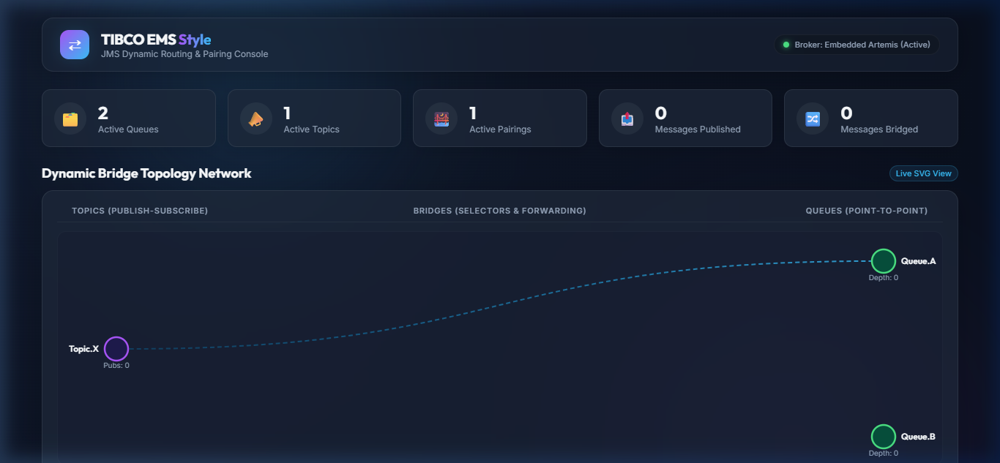
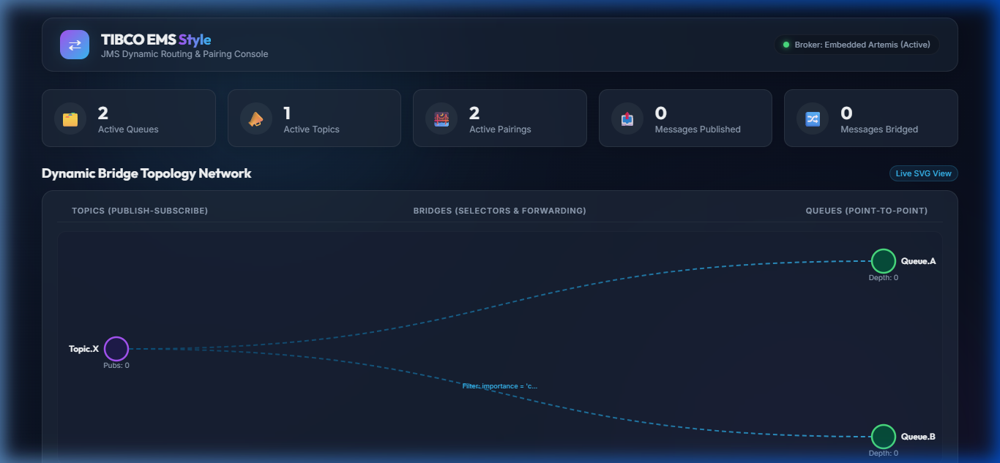
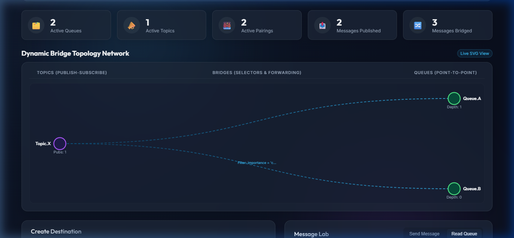
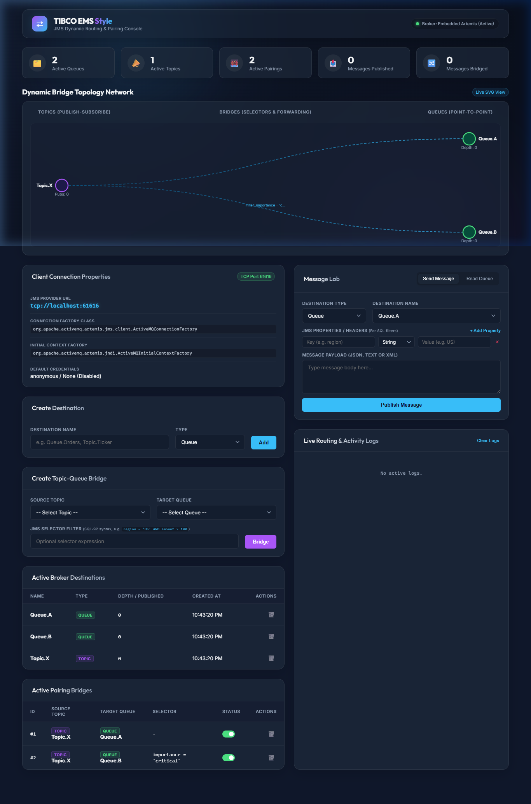

# Walkthrough: TIBCO EMS Style JMS Console

We have successfully built a Spring Boot-based TIBCO EMS style JMS management and dynamic routing service. It runs an embedded ActiveMQ Artemis server and features a real-time responsive dashboard console.

---

## 🏗️ Architecture Design & Components

The system is constructed with modular, highly focused components:

1. **JMS Core & TCP Acceptor:**
   - [EmbeddedJmsConfig.java](./src/main/java/com/ems/jmsservice/config/EmbeddedJmsConfig.java): Spawns the embedded Artemis broker inside the VM. It registers an **NIO TCP Acceptor** on port `61616` to handle external connections, alongside the default in-memory `vm://0` acceptor.

2. **Routing & Selector Pairing Engine:**
   - [JmsBridgeService.java](./src/main/java/com/ems/jmsservice/service/JmsBridgeService.java): The core router. It dynamically spins up Spring `DefaultMessageListenerContainer` instances when a Topic-to-Queue bridge is enabled, applies standard JMS SQL-92 selectors, and forwards matched messages to the target queues.

3. **Dynamic Administration APIs:**
   - [JmsApiController.java](./src/main/java/com/ems/jmsservice/controller/JmsApiController.java): Exposes endpoints for managing destinations, toggling bridges, publishing/consuming messages, and retrieving live connection settings via `/api/connection-info`.

4. **SSE Event Feeder:**
   - [EmsEventBroadcaster.java](./src/main/java/com/ems/jmsservice/service/EmsEventBroadcaster.java): Maintains SSE emitters to broadcast stats, forwarding events, and creations to the client console instantly.

---

## 📸 Visual Interface Walkthrough

Here is a visual progression of the TIBCO EMS Style JMS Management Console:

````carousel

<!-- slide -->

<!-- slide -->

<!-- slide -->

````

---

## 🎥 Video Demonstrations

The automated browser testing walkthrough recordings demonstrate the features of the JMS dynamic pairing console, including dynamic layouts, real-time log arrivals, and bridge packet-flow animations:

### 1. General Console Operations & Messaging Simulator
The video validates creating topics/queues, adding a default bridge, sending messages, routing verification, queue depth statistics updates, queue browsing, and message consumption.


### 2. Client Connection Properties Card Verification
The video demonstrates the dynamically loaded properties card showing connection factory classes, context URLs, default credentials, and port verification.


